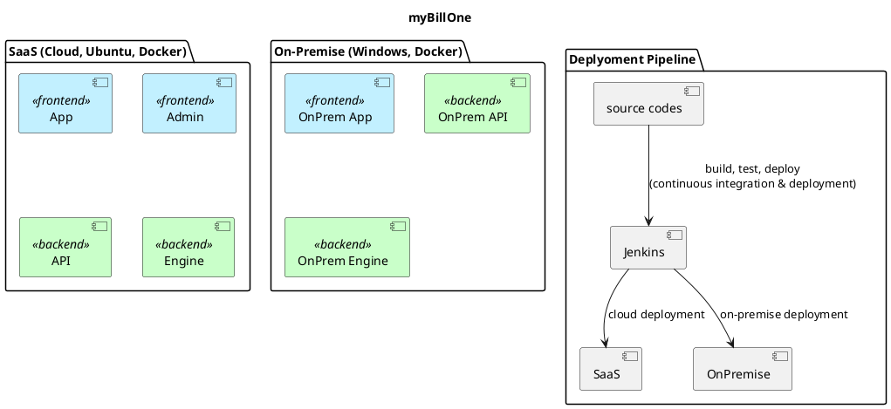
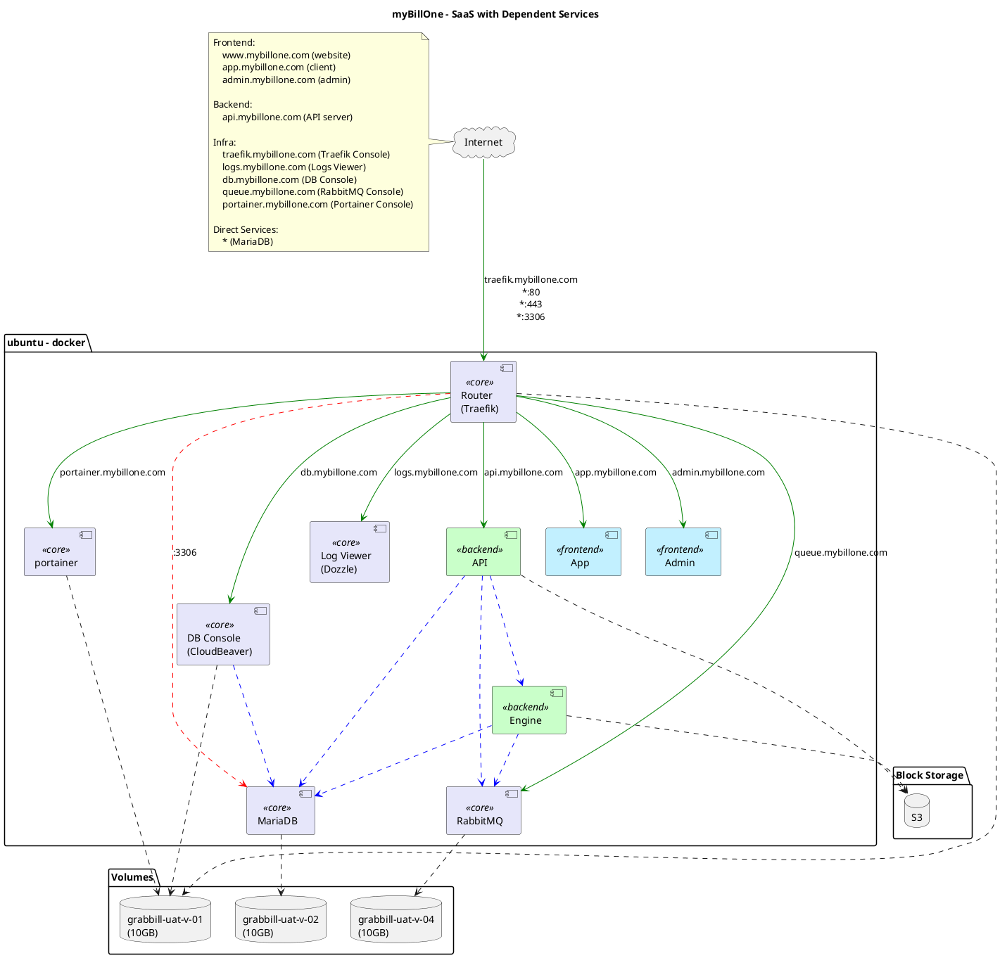
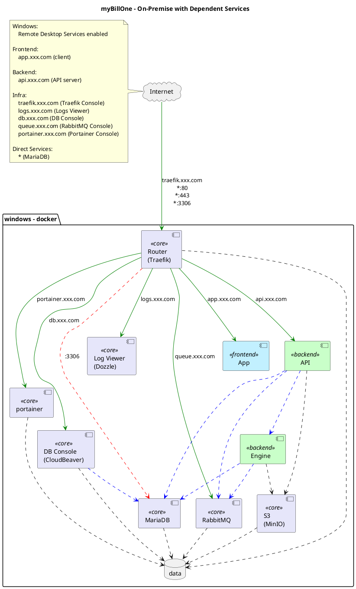

# Objective

- To enable myBillOne to be deployed on-premise while maintaining existing Software as a Service (SaaS) deployed to cloud. On-premise deployment will have slightly different features. Manage the software project so that it is maintainable as both an on-premise and SaaS where there will be common features and some unique features depending on deployment targets.

# Motivation

- While myBillOne (previously GrabBill) was developed as a SaaS model, business requirements have evolved and see the need to enable multiple on-premise deployments.
- Some SaaS that are not applicable for on-premise deployments will need to be disabled and tweaked.

# High Level Architecture

# High Level Approach for both SaaS & On-Premise

- While initial thoughts leaned towards separating existing myBillOne source code repository into multiple repositories, further analysis find this approach to be not practical for long term maintenance.
    - The proposed approach will maintain a single source code repository with common/shared code for both Saas & On-Premise. In addition, SaaS and each On-Premise deployment will have their specific application project directories. We will call this the "mono-repository" style.
- To support these the following key changes need to be done to the existing myBillOne source code repository.
    - Refactor to extract common codebase for server side (Java) and client side (Angular) into shareable source codes for both SaaS and on-premise.
    - Remove SaaS admin application and extract requires features into the single on-premise frontend application.

## Changes for On-Premise Application

Overview:

- Each on-premise deployment will require separate database.
- Docker as a critical feature to enable smooth deployment of this solution.
- No multi-tenancy.
- No sign up.
- No payment.
- Google login maintained
- MFA maintained.
### No Sign Up
- **Client**
    - User registration no longer allowed.
    - Owner account in the client will be created.
    - Client will used this account to manage the users in client portal.
    - No longer have limitation of how many total users to be created.
- **Admin**
- Only can see account detail.
- No plans.
- No payment.
- WhatsApp maintenance.
### Admin
- Feature no longer applied / will not exist in on-premise:
    - Dashboard
    - Affliate code
    - Promo code
    - Invoice
    - Billing cycle processing
    - Stripe event
    - Payment gateway integration
- Relevant features of admin application will be  move to client.
- WhatsApp configuration will be at WhatsApp settings
- Job list - retry failed job

### Client
- Login
    - Keep forget password
    - Remove register now
- Dashboard
- Monthly view just that no payment / invoice.
- User
- No longer have limit.
- Plan & Credits
- Will be removed.

### Branding
- Introduce configurations for White label, Image logo.

### Shared Codes
- To minimize duplication of work, existing project will be refactored to extract common features.

# Operations
- A new Trello board will be used to track, manage and support all activities for On-Premise deployed solution.
- Discussion on development of SaaS and On-Premise will be tracked and worked on separately.
- Common features will be tracked from SaaS project.
- All support activities will be via Trello.

## On-Premise Deployments
### Production Deployment
- CI/CD enabled.
- Windows server with Docker.
- Remote Desktop services enabled.
- Required ports opened.

### UAT Deployment
- CI/CD enabled.
- UAT set up in same machine.

# Estimated Efforts

With current velocity:
- Backend - 2 months
- Frontend - 2 months
- Deployment - 1 months
- Translates to roughly 10 sprints.

With increased velocity:
- Backend - 1.5 months
- Frontend - 1.5 months
- Deployment - 1 month (production only)
- Translates to roughly 8 sprints.

The above serves as an estimate. Actual performance depends on outcome of actual activities carried out. Can be less or more than estimation. Recommendation is to prioritise what needs to be done, and move as fast as possible with given resources.

# Not in scope

- Windows Server administration, maintenance, data (files and database) backup and security.
- For now, no UAT for On-Premise. If needed, add to On-Premise board.

# Current Status

- Started analysis of existing source code changes needed to support the new SaaS & On-Premise model.

# Follow-up Actions

- [ ] OK with proposal? Start now ok?
- [ ] Previously discussed tree/role based access control feature will be on hold, ok?
- [ ] Need a name for the on-premise application.
- [ ] Need details & access to Windows server.
- [ ] Need details on domains for new on-premise deployment.
- [ ] Commercial discussions.

# Rough Notes From Discussion with Alex

grabbill-core
grabbill-server
grabbill-engine

grabbill-op-xxx
grabbill-op-xxx
grabbill-op-xxx

GrabBill On-Premise
deployed for Documation
domain: app.e-stmt.com, api.e-stmt.com, *.uat.e-stmt.com

USE THIS:
*.sunlifemalaysia.e-stmt.com (prod)
*.uat.sunlifemalaysia.e-stmt.com (uat)

>>> documation is responsible to ensure that sunlifemalaysia requirements are met by grabbill.

current
e-stmt.my/eone-etika

app.etika.e-stmt.com

GrabBill On-Cloud
deployed for mybillone.com

april bring him back.
april start using will be nice.
may start using will be nice.
june latest latest.

- demo eone to identify gap. xxx
